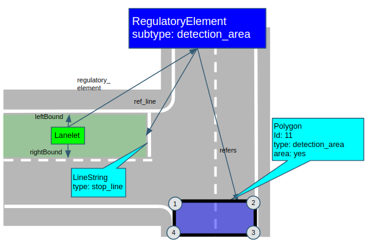
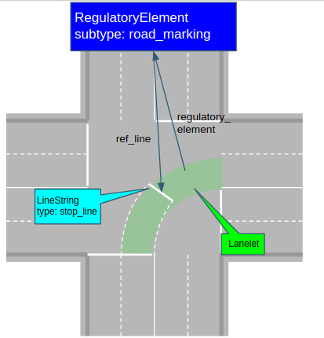
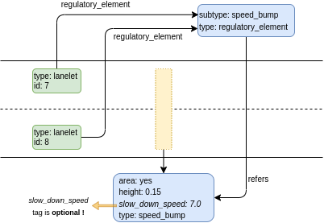

# Extra Regulatory Elements

## Detection Area

This regulatory element specifies region of interest which vehicle must pay attention whenever it is driving along the associated lanelet. When there are any obstacle in the detection area, vehicle must stop at specified stopline.

- refers: refers to detection area polygon. There could be multiple detection areas registered to a single regulatory element.
- ref_line: refers to stop line of the detection area



Sample detection area in .osm format is shown below:

```xml
  <node id=1 version='1' lat='49.00541994701' lon='8.41565013855'>
    <tag k=’ele’ v=’0’/>
  </node>
  <node id=2 version='1' lat='49.00542091657' lon='8.4156469497'>
    <tag k=’ele’ v=’0’/>
  </node>
  <node id=3 version='1' lat='49.00542180052' lon='8.41564400223'>
    <tag k=’ele’ v=’0’/>
  </node>
  <node id=4 version='1' lat='49.00541994701' lon='8.41564400223'>
    <tag k=’ele’ v=’0’/>
  </node>
  <node id=5 version='1' lat='49.00542180052' lon='8.41564400223'>
    <tag k=’ele’ v=’0’/>
  </node>
  <node id=6 version='1' lat='49.00541994701' lon='8.41564400223'>
    <tag k=’ele’ v=’0’/>
  </node>
  <way id=11 version='1'>
    <nd ref=1 />
    <nd ref=2 />
    <nd ref=3 />
    <nd ref=4 />
    <nd ref=1 />
    <tag k='type' v=’detection_area’ />
    <tag k='area' v=’yes’ />
  </way>
  <way id=12 version="1">
    <nd ref=5 />
    <nd ref=6 />
    <tag k='type' v=stop_line’ />
  </way>
  <relation id="13">
     <tag k="type" v="regulatory_element"/>
     <tag k="subtype" v="detection_area"/>
     <member type="way" ref="11" role="refers"/>
     <member type="way" ref="12" role="ref_line"/>
   </relation>
```

## Road Marking

This regulatory element specifies related road markings to a lanelet as shown below.

\* Note that the stopline in the image is for stoplines that are for reference, and normal stoplines should be expressed using TrafficSign regulatory element.

refers: linestring with type attribute. Type explains what road marking it represents (e.g. stopline).



## Speed Bump

This regulatory element specifies a speed bump on the road.

- refers: to a speed bump polygon. There must be only one speed bump polygon registered to a single
  regulatory element.



An example annotation of speed_bump:

```xml
  <node id='1' lat='40.81478464668' lon='29.35984444811'>
    <tag k='ele' v='3.004897' />
    <tag k='x' v='138.2702' />
    <tag k='y' v='326.5387' />
  </node>
  <node id='2' lat='40.81476705154' lon='29.3599302694'>
    <tag k='ele' v='2.949194' />
    <tag k='x' v='145.5616' />
    <tag k='y' v='324.7803' />
  </node>
  <node id='3' lat='40.81477166944' lon='29.35993194259'>
    <tag k='ele' v='2.948368' />
    <tag k='x' v='145.6889' />
    <tag k='y' v='325.2968' />
  </node>
  <node id='4' lat='40.81478914798' lon='29.35984590876'>
    <tag k='ele' v='3.018582' />
    <tag k='x' v='138.3799' />
    <tag k='y' v='327.0417' />
  </node>
  <way id='5'>
    <nd ref='1' />
    <nd ref='2' />
    <nd ref='3' />
    <nd ref='4' />
    <tag k='area' v='yes' />
    <tag k='height' v='0.15' />
    <tag k='type' v='speed_bump' />
  </way>
  <relation id='6'>
    <member type='way' ref='5' role='refers' />
    <tag k='subtype' v='speed_bump' />
    <tag k='type' v='regulatory_element' />
  </relation>
  <relation id='7'>
    <member type='relation' ref='6' role='regulatory_element' />
    <member type='way' ref='10' role='left' />
    <member type='way' ref='11' role='right' />
    <tag k='location' v='urban' />
    <tag k='participant:vehicle' v='yes' />
    <tag k='speed_limit' v='30.00' />
    <tag k='subtype' v='road' />
    <tag k='type' v='lanelet' />
  </relation>
  <relation id='8'>
    <member type='relation' ref='6' role='regulatory_element' />
    <member type='way' ref='12' role='left' />
    <member type='way' ref='10' role='right' />
    <tag k='location' v='urban' />
    <tag k='participant:vehicle' v='yes' />
    <tag k='speed_limit' v='30.00' />
    <tag k='subtype' v='road' />
    <tag k='type' v='lanelet' />
  </relation>
```

- As an option `slow_down_speed` tag can be added to the speed bump way annotation to override the
  speed calculated in planning module wrt the speed bump `height`. The value specified in
  `slow_down_speed` tag must be in **kph**. So if this option is used then the way annotation should
  look like as below:

```xml
  <way id='5'>
    <nd ref='1' />
    <nd ref='2' />
    <nd ref='3' />
    <nd ref='4' />
    <tag k='area' v='yes' />
    <tag k='height' v='0.15' />
    <tag k='slow_down_speed' v='7.0' />
    <tag k='type' v='speed_bump' />
  </way>
```
